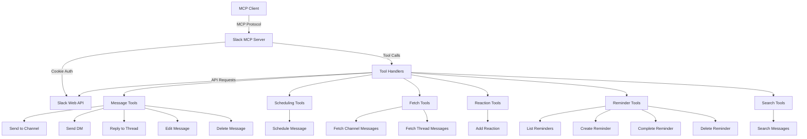

# Slack MCP Server - Architecture & Design Document

## Overview
A Model Context Protocol (MCP) server that provides tools for interacting with Slack using cookie-based authentication from web sessions. This server enables sending/editing/deleting messages, scheduling messages, managing reminders, fetching conversations for summarization, and reacting to messages.

## Authentication Strategy

### Phase 1: Cookie-Based Authentication (Current Scope)
- Uses the `d` cookie from Slack web session
- Reference: https://papermtn.co.uk/retrieving-and-using-slack-cookies-for-authentication/
- Requires users to extract cookie from their browser's developer tools
- Single workspace focus

### Phase 2: OAuth/Bot Token Support (Future)
- Support for official Slack OAuth tokens
- Support for Bot tokens
- Multi-workspace capability

## System Architecture



## Core Components

### 1. Slack Client Module (`src/slack-client.ts`)
**Purpose**: Handle all Slack API interactions with cookie authentication

**Key Features**:
- Cookie-based authentication handler
- HTTP client configuration with proper headers
- Rate limiting and retry logic
- Error handling for API responses

**Methods**:
- `authenticate()`: Validate cookie and get workspace info
- `sendMessage()`: Send messages to channels/DMs
- `updateMessage()`: Edit existing messages
- `deleteMessage()`: Delete messages
- `scheduleMessage()`: Schedule messages using Slack API
- `fetchMessages()`: Retrieve messages from channels/threads
- `addReaction()`: Add emoji reactions to messages
- `listReminders()`: Get all user reminders
- `createReminder()`: Create new reminders
- `completeReminder()`: Mark reminders as done
- `deleteReminder()`: Remove reminders
- `searchMessages()`: Search for messages across workspace
- `getUserInfo()`: Get user information
- `getChannelInfo()`: Get channel information

### 2. Tool Handlers (`src/tools/`)

#### a. Message Tools (`message-tools.ts`)
- **send_message**: Send messages to channels or DMs
- **reply_to_thread**: Reply to a specific thread
- **send_direct_message**: Send a DM to a user
- **edit_message**: Edit previously sent messages
- **delete_message**: Delete previously sent messages

**Input Parameters**:
```typescript
{
  channel?: string;        // Channel ID or name
  user?: string;           // User ID for DMs
  text: string;            // Message content
  thread_ts?: string;      // Thread timestamp for replies
  blocks?: Array<Block>;   // Rich formatting (optional)
}
```

#### b. Scheduling Tools (`schedule-tools.ts`)
- **schedule_message**: Schedule a message for future delivery

**Input Parameters**:
```typescript
{
  channel: string;         // Channel ID
  text: string;            // Message content
  post_at: number;         // Unix timestamp
  thread_ts?: string;      // Thread timestamp (optional)
}
```

#### c. Fetch Tools (`fetch-tools.ts`)
- **fetch_channel_messages**: Get recent messages from a channel
- **fetch_thread_messages**: Get all messages from a specific thread

**Input Parameters**:
```typescript
{
  channel: string;         // Channel ID
  limit?: number;          // Number of messages (default: 50, max: 200)
  thread_ts?: string;      // Thread timestamp for thread messages
  oldest?: string;         // Oldest timestamp to include
  latest?: string;         // Latest timestamp to include
}
```

**Output Format**:
```typescript
{
  messages: Array<{
    user: string;
    text: string;
    ts: string;
    thread_ts?: string;
    reply_count?: number;
    reactions?: Array<{
      name: string;
      count: number;
    }>;
  }>;
  message_count: number;
}
```

#### d. Reaction Tools (`reaction-tools.ts`)
- **add_reaction**: Add an emoji reaction to a message

**Input Parameters**:
```typescript
{
  channel: string;         // Channel ID
  timestamp: string;       // Message timestamp
  reaction: string;        // Emoji name (without colons)
}
```

#### e. Search Tools (`search-tools.ts`)
- **search_messages**: Search for messages across all channels

**Input Parameters**:
```typescript
{
  query: string;           // Search query with optional modifiers
  count?: number;          // Results per page (1-100, default: 20)
  page?: number;           // Page number (default: 1)
  sort?: 'score' | 'timestamp';  // Sort by relevance or time (default: score)
  sort_dir?: 'asc' | 'desc';     // Sort direction (default: desc)
  highlight?: boolean;     // Enable highlighting (default: true)
}
```

**Search Query Modifiers**:
- `from:@username` - Messages from specific user
- `in:#channel` - Messages in specific channel
- `has:link` - Messages with links
- `has:file` - Messages with file attachments
- `has:reaction` - Messages with reactions
- `before:YYYY-MM-DD` - Messages before date
- `after:YYYY-MM-DD` - Messages after date

**Output Format**:
```typescript
{
  messages: Array<{
    user: string;
    user_name: string;
    text: string;
    ts: string;
    timestamp: string;
    channel_id: string;
    channel_name: string;
    permalink: string;
    thread_ts?: string;
    reactions?: Array<{
      name: string;
      count: number;
    }>;
  }>;
  message_count: number;   // Results on current page
  total_count: number;     // Total matching messages
  page: number;            // Current page number
  page_count: number;      // Total pages
}
```

#### f. Reminder Tools (`reminder-tools.ts`)
- **list_reminders**: List all active reminders
- **create_reminder**: Create new reminders
- **complete_reminder**: Mark reminders as completed
- **delete_reminder**: Remove reminders

**Input Parameters (create_reminder)**:
```typescript
{
  text: string;            // Reminder text (max 1000 chars)
  time: number;            // Unix timestamp (seconds)
  user?: string;           // User ID (optional, defaults to self)
}
```

**Output Format (list_reminders)**:
```typescript
{
  reminders: Array<{
    id: string;
    text: string;
    time: number;
    time_formatted: string;
    user: string;
    user_name?: string;
    recurring: boolean;
    completed: boolean;
  }>;
  reminder_count: number;
}
```

### 3. Utilities (`src/utils/`)

#### a. Validation (`validation.ts`)
- Channel ID/name validation
- User ID validation
- Timestamp format validation
- Emoji name validation
- Message length validation

#### b. Formatters (`formatters.ts`)
- Convert Slack message objects to readable text
- Format timestamps to human-readable dates
- Handle mentions, channels, and special formatting
- Create markdown-friendly output for AI processing

#### c. Error Handling (`errors.ts`)
- Custom error classes for different scenarios
- Slack API error mapping
- User-friendly error messages
- Debug logging

## Security Considerations

### 1. Cookie Storage
- Store cookie in environment variable (`SLACK_COOKIE_D`)
- Never log or expose the cookie value
- Validate cookie format before use
- Clear instructions for users on secure cookie extraction

### 2. API Rate Limiting
- Implement exponential backoff for rate limits
- Respect Slack's rate limit headers
- Queue requests if necessary
- Log rate limit warnings

### 3. Input Validation
- Sanitize all user inputs
- Validate channel/user IDs format
- Limit message lengths
- Prevent injection attacks

### 4. Error Information
- Don't expose sensitive data in error messages
- Sanitize error responses
- Log detailed errors internally only

## API Endpoints Used

### Web API Endpoints (with cookie auth)
- `POST /api/chat.postMessage` - Send messages
- `POST /api/chat.scheduleMessage` - Schedule messages
- `GET /api/conversations.history` - Fetch channel messages
- `GET /api/conversations.replies` - Fetch thread replies
- `POST /api/reactions.add` - Add reactions
- `POST /api/chat.update` - Edit messages
- `POST /api/chat.delete` - Delete messages
- `GET /api/reminders.list` - List reminders
- `POST /api/reminders.add` - Create reminders
- `POST /api/reminders.complete` - Complete reminders
- `POST /api/reminders.delete` - Delete reminders
- `GET /api/search.messages` - Search messages
- `GET /api/conversations.list` - List channels
- `GET /api/users.list` - List users
- `POST /api/auth.test` - Validate authentication

## Configuration

### Environment Variables
```bash
SLACK_COOKIE_D=xoxd-...         # Required: Slack session cookie
SLACK_WORKSPACE_ID=T...          # Optional: Workspace ID for validation
SLACK_USER_ID=U...               # Optional: User ID for validation
LOG_LEVEL=info                   # Optional: Logging level
```

### MCP Settings Configuration
```json
{
  "mcpServers": {
    "slack": {
      "command": "node",
      "args": ["/path/to/slack-mcp/build/index.js"],
      "env": {
        "SLACK_COOKIE_D": "user-slack-d-cookie"
      },
      "disabled": false,
      "alwaysAllow": [],
      "disabledTools": []
    }
  }
}
```

## Project Structure

```
slack-mcp/
├── package.json
├── tsconfig.json
├── .eslintrc.cjs
├── .prettierrc.json
├── README.md
├── ARCHITECTURE.md
├── src/
│   ├── index.ts                 # Main MCP server entry point
│   ├── slack-client.ts          # Slack API client
│   ├── types.ts                 # TypeScript type definitions
│   ├── tools/
│   │   ├── index.ts             # Tool exports
│   │   ├── message-tools.ts     # Message sending/editing/deleting tools
│   │   ├── schedule-tools.ts    # Message scheduling tools
│   │   ├── fetch-tools.ts       # Message fetching tools
│   │   ├── reaction-tools.ts    # Reaction tools
│   │   ├── reminder-tools.ts    # Reminder management tools
│   │   ├── search-tools.ts      # Message search tools
│   │   └── user-tools.ts        # User search tools
│   └── utils/
│       ├── validation.ts        # Input validation
│       ├── formatters.ts        # Message formatting
│       ├── errors.ts            # Error handling
│       └── logger.ts            # Logging utility
└── build/                       # Compiled JavaScript output
```

## Tool Specifications

### 1. send_message
**Description**: Send a message to a Slack channel or direct message

**Parameters**:
- `channel` (string, required): Channel ID (C...) or channel name
- `text` (string, required): Message content (max 40,000 chars)
- `thread_ts` (string, optional): Thread timestamp to reply to
- `unfurl_links` (boolean, optional): Enable link previews (default: true)

**Returns**: Message timestamp and channel ID

---

### 2. send_direct_message
**Description**: Send a direct message to a specific user

**Parameters**:
- `user` (string, required): User ID (U...) or username
- `text` (string, required): Message content
- `thread_ts` (string, optional): Thread timestamp if continuing conversation

**Returns**: Message timestamp and conversation ID

---

### 3. reply_to_thread
**Description**: Reply to a specific thread in a channel

**Parameters**:
- `channel` (string, required): Channel ID
- `thread_ts` (string, required): Parent message timestamp
- `text` (string, required): Reply content
- `broadcast` (boolean, optional): Also send to channel (default: false)

**Returns**: Message timestamp

---

### 4. edit_message
**Description**: Edit a previously sent message

**Parameters**:
- `channel` (string, required): Channel ID
- `timestamp` (string, required): Message timestamp to edit
- `text` (string, required): New message content

**Returns**: Updated message timestamp

---

### 5. delete_message
**Description**: Delete a previously sent message

**Parameters**:
- `channel` (string, required): Channel ID
- `timestamp` (string, required): Message timestamp to delete

**Returns**: Success confirmation

---

### 6. schedule_message
**Description**: Schedule a message to be sent at a future time

**Parameters**:
- `channel` (string, required): Channel ID
- `text` (string, required): Message content
- `post_at` (number, required): Unix timestamp for delivery
- `thread_ts` (string, optional): Thread timestamp if replying

**Returns**: Scheduled message ID and post time

---

### 7. fetch_channel_messages
**Description**: Fetch recent messages from a channel for summarization

**Parameters**:
- `channel` (string, required): Channel ID or name
- `limit` (number, optional): Number of messages to fetch (default: 50, max: 200)
- `oldest` (string, optional): Oldest timestamp to include
- `latest` (string, optional): Latest timestamp to include

**Returns**: Array of messages with formatted text for AI processing

---

### 8. fetch_thread_messages
**Description**: Fetch all messages from a specific thread

**Parameters**:
- `channel` (string, required): Channel ID
- `thread_ts` (string, required): Thread parent timestamp
- `limit` (number, optional): Max messages (default: 100, max: 200)

**Returns**: Array of thread replies with formatted text

---

### 9. add_reaction
**Description**: Add an emoji reaction to a message

**Parameters**:
- `channel` (string, required): Channel ID
- `timestamp` (string, required): Message timestamp
- `reaction` (string, required): Emoji name without colons (e.g., "thumbsup")

**Returns**: Success confirmation

---

### 10. list_reminders
**Description**: List all active reminders for the user

**Parameters**: None

**Returns**: Array of reminders with formatted text

---

### 11. create_reminder
**Description**: Create a new reminder

**Parameters**:
- `text` (string, required): Reminder text (max 1000 chars)
- `time` (number, required): Unix timestamp in seconds
- `user` (string, optional): User ID to set reminder for

**Returns**: Reminder ID and scheduled time

---

### 12. complete_reminder
**Description**: Mark a reminder as completed

**Parameters**:
- `reminder_id` (string, required): Reminder ID

**Returns**: Success confirmation

---

### 13. delete_reminder
**Description**: Delete a reminder permanently

**Parameters**:
- `reminder_id` (string, required): Reminder ID

**Returns**: Success confirmation

---

### 14. search_messages
**Description**: Search for messages across all channels in the workspace

**Parameters**:
- `query` (string, required): Search query with optional modifiers
  - Supports: `from:@user`, `in:#channel`, `has:link`, `before:YYYY-MM-DD`, `after:YYYY-MM-DD`
- `count` (number, optional): Results per page (1-100, default: 20)
- `page` (number, optional): Page number for pagination (default: 1)
- `sort` (enum, optional): Sort by 'score' or 'timestamp' (default: score)
- `sort_dir` (enum, optional): Sort direction 'asc' or 'desc' (default: desc)
- `highlight` (boolean, optional): Enable search term highlighting (default: true)

**Returns**: Array of matching messages with pagination info

**Examples**:
- Basic: `"project deadline"`
- User filter: `"from:@john urgent"`
- Channel filter: `"in:#general meeting notes"`
- Date filter: `"after:2024-01-01 announcement"`
- Combined: `"from:@sarah in:#product has:link after:2024-01-01"`

---

## Error Handling Strategy

### Error Types
1. **Authentication Errors**: Invalid or expired cookie
2. **Permission Errors**: Insufficient permissions for action
3. **Not Found Errors**: Channel, user, or message not found
4. **Rate Limit Errors**: API rate limit exceeded
5. **Validation Errors**: Invalid input parameters
6. **Network Errors**: Connection or timeout issues

### Error Response Format
```typescript
{
  content: [{
    type: "text",
    text: "Error: <user-friendly-message>"
  }],
  isError: true
}
```

## Implementation Best Practices

### 1. Type Safety
- Use TypeScript strict mode
- Define interfaces for all API responses
- Use Zod for runtime validation
- No `any` types

### 2. Code Organization
- Single Responsibility Principle
- Separate concerns (API client, tools, utils)
- Modular and testable code
- Clear function naming

### 3. Performance
- Minimize API calls
- Implement caching where appropriate
- Use pagination for large datasets
- Async/await for all I/O operations

### 4. Reliability
- Retry logic for transient failures
- Graceful degradation
- Comprehensive error logging
- Clear error messages for users

### 5. Maintainability
- Extensive JSDoc comments
- README with setup instructions
- Examples for each tool
- Version control friendly structure

## Testing Strategy

### Manual Testing Checklist
1. Cookie authentication validation
2. Send message to channel
3. Send direct message to user
4. Reply to thread
5. Edit message
6. Delete message
7. Schedule message for future
8. Fetch channel messages with different limits
9. Fetch thread messages
10. Add reactions to messages
11. List reminders
12. Create reminder
13. Complete reminder
14. Delete reminder
15. Search messages with various filters
16. Error handling for invalid inputs
17. Rate limit handling

### Test Scenarios
- Valid and invalid channel IDs
- Valid and invalid user IDs
- Empty messages
- Very long messages
- Special characters in messages
- Invalid timestamps
- Expired/invalid cookies
- Network failures

## Future Enhancements

### Phase 2 Features
- OAuth 2.0 token support
- Bot token support
- Multi-workspace management
- File upload capability
- User presence information
- Channel creation/management
- Pin/bookmark management

### Phase 3 Features
- Slack Events API integration
- Real-time message monitoring
- Custom emoji support
- Slash command integration
- Interactive components (buttons, modals)
- Workflow automation

## Dependencies

### Core Dependencies
- `@modelcontextprotocol/sdk`: MCP SDK for server implementation
- `axios`: HTTP client for Slack API calls
- `zod`: Runtime type validation
- `typescript`: Type safety

### Development Dependencies
- `@typescript-eslint/parser`: TypeScript linting
- `@typescript-eslint/eslint-plugin`: ESLint rules
- `eslint`: Code linting
- `prettier`: Code formatting
- `@types/node`: Node.js type definitions

## Documentation Deliverables

### 1. README.md
- Quick start guide
- How to extract Slack cookie
- Configuration instructions
- Tool usage examples
- Troubleshooting guide

### 2. ARCHITECTURE.md (this document)
- System design
- Component descriptions
- API specifications
- Security considerations

### 3. SETUP_GUIDE.md
- Step-by-step cookie extraction
- MCP configuration
- Testing the server
- Common issues and solutions

## Success Criteria

1. ✅ Successfully authenticate using Slack cookie
2. ✅ Send messages to channels and DMs
3. ✅ Reply to threads
4. ✅ Edit and delete messages
5. ✅ Schedule messages using native Slack API
6. ✅ Fetch and format messages for AI summarization
7. ✅ Add emoji reactions to messages
8. ✅ Manage reminders (list, create, complete, delete)
9. ✅ Comprehensive error handling
10. ✅ Security best practices implemented
11. ✅ Clear documentation for users
12. ✅ Working MCP server integration